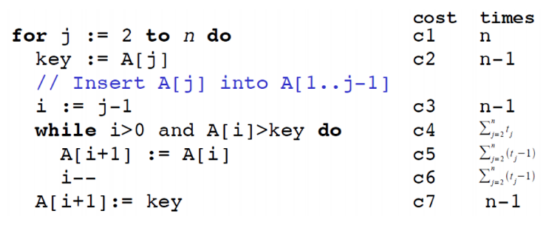
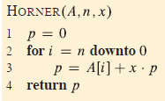

**Exercises**:  
**1. Insertion Sort**  

*“The RAM model assumes that each instruction takes the same amount of time as any other instruction”*
          We use the RAM model to calculate the cost, where the cost pr line of code is Θ(1).
For our tasks we decide n=6

  a. Consider the application of insertion sort on an integer array with n (𝑛≥4) elements. Create at least 8 instances of this array (including the sorted and reverse sorted instances) and calculate the running time for each instance. Make a bar chart of the estimated running times indicating the best and worst cases.

    **1. [1,2,3,4,5,6]** (Best case) (Formula is NOT valid, c5 and c6 are 0 for THIS SPECIFIC CODE)

    $ T(n) = c_1 n + c_2 (n-1) + c_3 (n-1) + c_4 (n-1) + c_5 (n-1) + c_6 (n-1) + c_7 (n-1) $

    $ cost = c_1 6 + c_2 5 + 0 + 0 + c_7 5 $
    $ cost = 6 + 5 + 5 + 5 + 0 + 0 + 5 = 26 $

    **2. [6,5,4,3,2,1]** (Worst case)

    $ T(n) = c_1 n + c_2 (n-1) + c_3 (n-1) + c_4 (n(n-1)/2 -1) + c_5 (n(n-1)/2) + c_6 (n(n-1)/2) + c_7 (n-1) $

    $ cost = c_1 6 + c_2 5 + c_3 5 + c_4 (6*5/2 -1) + c_5 (6*5/2) + c_6 (6*5/2) + c_7 5 $
    $ cost = 6 + 5 + 5 + 14 + 15 + 15 + 5 = 63 $

    **3. [5,2,1,3,4,6]**

    While loop comparison count:

    1: [2,5,1,3,4,6] -> 1
    2: [1,2,5,3,4,6] -> 2
    3: [1,2,3,5,4,6] -> 2
    4: [1,2,3,4,5,6] -> 2
    5: [1,2,3,4,5,6] -> 1

    $$ T(n) = c_1 n + c_2 (n-1) + c_3 (n-1) + c_4 \sum{j=2}^n t_j + c_5 \sum{j=2}^n (t_j-1) + c_6 \sum{j=2}^n (t_j-1) + c_7 (n-1)$$

    $ cost = c_1 6 + c_2 5 + c_3 5 + c_4 \sum{j=2}^6 t_j + c_5 \sum{j=2}^6 (t_j-1) + c_6 \sum{j=2}^6 (t_j-1) + c_7 5 $
    $ cost = 6 + 5 + 5 + (1 + 2 + 2 + 2 + 1) + (0 + 1 + 1 + 1 + 0) + (0 + 1 + 1 + 1 + 0) + 5 $
    $ cost = 16 + (8) + (3) + (3) + 5 = 35 $

    **4. [4, 6, 2, 1, 5, 3] **
    Comparison:
    [4, **6**, 2, 1, 5, 3] -> 1 -> [4, **6**, 2, 1, 5, 3]
    [4, 6, **2**, 1, 5, 3] -> 2 -> [**2**, 4, 6, 1, 5, 3]
    [2, 4, 6, **1**, 5, 3] -> 3 -> [**1**, 2, 4, 6, 5, 3] 
    [1, 2, 4, 6, **5**, 3] -> 2 -> [1, 2, 4, **5**, 6, 3] 
    [1, 2, 4, 5, 6, **3**] -> 4 -> [1, 2, **3**, 4, 5, 6]

    $ cost = c_1 6 + c_2 5 + c_3 5 + c_4 \sum{j=2}^6 t_j + c_5 \sum{j=2}^6 (t_j-1) + c_6 \sum{j=2}^6 (t_j-1) + c_7 5 $
    $ cost = 6 + 5 + 5 + (1 + 2 + 3 + 2 + 4 ) + (0 + 1 + 2 + 1 + 3) + (0 + 1 + 2 + 1 + 3) + 5 $
    $ cost = 16 + (12) + (7) + (7) + 5 = 47 $

  b. Show that the insertion sort algorithm (pseudocode in the lecture slide) is correct. FORTSÆT HERFRA
  **Proof of correctness:**
  **Claim:** Insertion-Sort sorts the input list for increasing integers so that {A1, A2, A3, ...}

  c. Implement the insertion sort algorithm and ensure to time its execution.
    i. Verify that your implementation of the algorithm is correct.
    ii. Plot the averaged running time estimate as a function of the size of the input array, n. You are to generate arrays of random integers of the appropriate size for the tests. 

**2. Sum-array**
  - Consider the procedure SUM-ARRAY in Figure 1. It computes the sum of the n numbers in array $\ A[1…n]\$.

    a. State a loop invariant for this procedure, and use its initialization, maintenance, and termination properties to show that the SUM-ARRAY procedure returns the sum of the numbers in $\ A[1…n]\$.

    b. Determine the exact and asymptotic complexity of the procedure.

  

 
**3. Algorithm for Polynomial Evaluation**
  - You are given the coefficients, $\ 𝑎_1,⋯,𝑎_n \$, of a polynomial:

  $$P(x) = \sum_{k=0}^n a_k x^k = a_0 + a_1 x^2 + ... + a_n-1 x^n-1 + a_n x^n$$

  - and you want to evaluate this polynomial for a given value of 𝑥𝑥 . With Horner’s rule we evaluate the polynomial according to this parenthesization:

  $$P(x) = a_0 + x (a_1 + x (a_2 + ... + x (a_n-1 + x a_n) ... ))$$

  - Algorithm HORNER in Figure 2 implements Horner’s rule to evaluate P(x), given the coefficients, $\ 𝑎_1,⋯,𝑎_n \$ in an array $\ A[0…n]\$ and the value of x.

    a. What is the running time of algorithm HORNER in terms of \Theta-notation.

    b. Write pseudocode to implement the naive polynomial-evaluation algorithm that computes each term of the polynomial from scratch. What is the running time of this algorithm? How does it compare with HORNER?

    c. Consider the following loop invariant for the procedure HORNER (At the start of each iteration of the for loop of lines 2 - 3):

    $$P(x) = \sum_{k}^n-(i+1) A[k+i+1] × x^k$$

    d. Using any programming language of your choice, implement algorithm HORNER and the algorithm in b.
      i. Run both algorithms with n = 10, n = 100 and n = 1000 and ensure to time its execution. In all cases, set the array $\ 𝐴 = [1,…,𝑛+1] \$. Compare your estimate of the running times averaged over 100 repeated run with each input size. How does your results compare to the growth rate predicted in a and b.

  

**3. Inversions:**
  - Let \$ 𝐴[1:𝑛] \$ be an array of n distinct numbers. If 𝑖𝑖 < 𝑗𝑗 and \$ 𝐴[𝑖𝑖] > 𝐴[𝑗𝑗] \$, then the pair (𝑖,𝑗) is called an inversion of 𝐴.
    a. List the five inversions of the array <2,3,8,6,1>

    b. What array with elements from the set {1,2,…,𝑛} has the most inversions? How many does it have?

    c. What is the relationship between the running time of insertion sort and the number of inversions in the input array? Justify your answer .

    d. Give an algorithm that determines the number of inversions in any permutation on n elements in $\ Θ(𝑛log(𝑛)) \$ worst-case time. (Hint: Modify merge sort.)

    e. Implement the algorithm in d and verify its correctness.