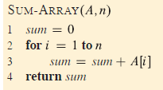

**Exercises**:  
**1. Insertion Sort**  
  a. Consider the application of insertion sort on an integer array with n (𝑛≥4) elements. Create at least 8 instances of this array (including the sorted and reverse sorted instances) and calculate the running time for each instance. Make a bar chart of the estimated running times indicating the best and worst cases.

  b. Show that the insertion sort algorithm (pseudocode in the lecture slide) is correct.

  c. Implement the insertion sort algorithm and ensure to time its execution.
    i. Verify that your implementation of the algorithm is correct.
    ii. Plot the averaged running time estimate as a function of the size of the input array, n. You are to generate arrays of random integers of the appropriate size for the tests. 

**2. Sum-array**
  - Consider the procedure SUM-ARRAY in Figure 1. It computes the sum of the n numbers in array $\ A[1…n]\$.

    a. State a loop invariant for this procedure, and use its initialization, maintenance, and termination properties to show that the SUM-ARRAY procedure returns the sum of the numbers in $\ A[1…n]\$.

    b. Determine the exact and asymptotic complexity of the procedure.

  

 
**3. Algorithm for Polynomial Evaluation**
  - You are given the coefficients, $\ 𝑎_1,⋯,𝑎_n \$, of a polynomial:

  $$P(x) = \sum_{k=0}^n a_k x^k = a_0 + a_1 x^2 + ... + a_n-1 x^n-1 + a_n x^n$$

  and you want to evaluate this polynomial for a given value of 𝑥𝑥 . With Horner’s rule we evaluate the polynomial according to this parenthesization:

  $$P(x) = a_0 + x (a_1 + x (a_2 + ... + x (a_n-1 + x a_n) ... ))$$

  Algorithm HORNER in Figure 2 implements Horner’s rule to evaluate P(x), given the coefficients, $\ 𝑎_1,⋯,𝑎_n \$ in an array $\ A[0…n]\$ and the value of x.

    a. What is the running time of algorithm HORNER in terms of \Theta-notation.

    b. Write pseudocode to implement the naive polynomial-evaluation algorithm that computes each term of the polynomial from scratch. What is the running time of this algorithm? How does it compare with HORNER?

    c. Consider the following loop invariant for the procedure HORNER (At the start of each iteration of the for loop of lines 2 - 3):

  $$P(x) = \sum_{k}^n-(i+1) A[k+i+1] × x^k$$
